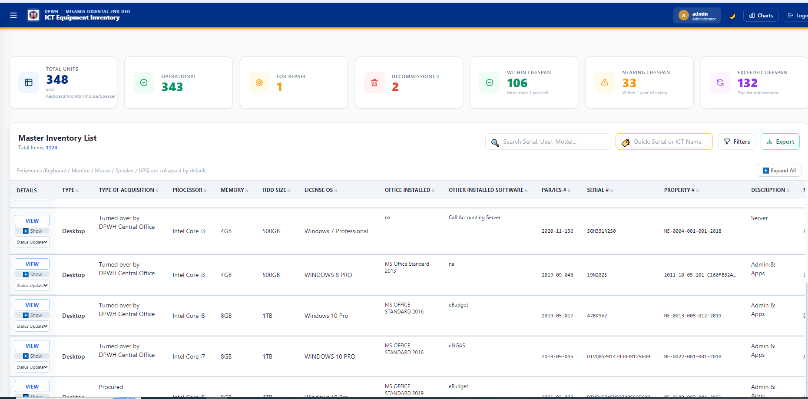
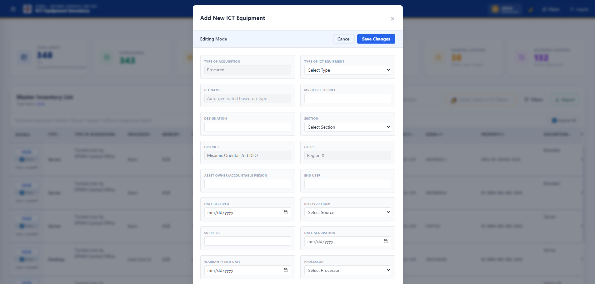
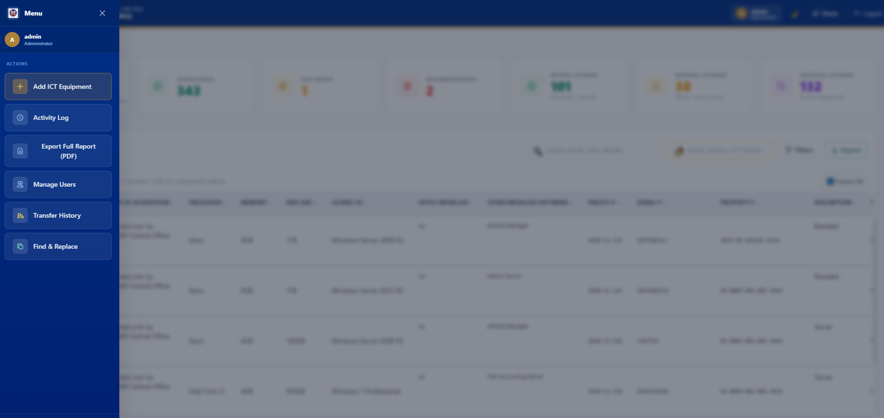

# MOSDEO ICT Inventory System

A web-based ICT equipment inventory and tracking system built for the **DPWH Misamis Oriental 2nd District Engineering Office (MOSDEO)**, designed to replace manual, spreadsheet-only tracking of computers, servers, and peripherals with a searchable, role-based, browser-accessible dashboard.

Built entirely on **Google Apps Script + Google Sheets** — no external database or hosting required.

---

## 📋 Overview

This system manages the full lifecycle of ICT equipment: from acquisition and assignment, through warranty and lifespan tracking, to transfers and eventual decommissioning — all backed by a Google Sheet acting as the database, with a full custom web interface on top.

---

## ✨ Key Features

**Inventory Management**
- Add, edit, and track ICT equipment (desktops, laptops, servers, printers, and peripherals)
- Auto-generated ICT Names with sequential numbering per equipment type
- Server units use a dedicated dropdown (3 known physical servers) with auto-incrementing unit numbers
- Peripherals (Keyboard, Monitor, Mouse, Speaker, UPS) are automatically linked to their parent unit and grouped together in the list, with expand/collapse controls
- Excel-style autocomplete on free-text fields (Brand, Model, Supplier, End User, Designation, etc.), built from existing inventory values

**Dashboard**
- Live summary cards: Total Units, Operational, For Repair, Decommissioned, and Lifespan status (Good / Aging / Replace)
- **Click-to-filter**: clicking any summary card instantly filters the table below to show exactly those units, with a clear visual "Filtered" badge and one-click reset
- Visual charts for inventory breakdown and warranty status

**Warranty & Lifespan Tracking**
- Warranty End Date auto-calculated as Date Acquired + 5 years
- Automatic status badges for expiring/expired warranties
- Lifespan status tracking to flag units due for replacement

**Records & Compliance**
- Auto-generated PAR (Property Acknowledgement Receipt) documents
- Full Transfer History log per unit and system-wide
- Activity Log tracking logins, edits, and administrative actions
- Export to PDF and Excel/CSV, with support for filtered exports

**Administration**
- Role-based access (Admin / Staff) — sensitive tools (User Management, Find & Replace, Full Report Export) are hidden from non-Admin accounts
- Bulk Find & Replace tool with a preview step before committing changes
- User management panel for creating/managing accounts

**Usability**
- Text wraps instead of truncating, so long entries (software lists, remarks) are always fully readable
- Responsive sidebar navigation with mobile support
- Dark mode support

---

## 🖼️ Screenshots

**Login Screen**
Clean, branded entry point with username/password authentication.


**Dashboard & Master Inventory List**
Live summary cards (Total Units, Operational, For Repair, Decommissioned, and Lifespan status) sit above a searchable, sortable master list of all ICT equipment — with peripherals grouped under their parent unit and collapsible by default.



**Add / Edit ICT Equipment**
A structured form for adding new equipment, with auto-generated ICT Names, dropdowns for standardized fields, and autocomplete on free-text entries pulled from existing inventory data.



**Sidebar Navigation**
Role-based action menu — Admin-only tools like Manage Users, Find & Replace, and Export Full Report are hidden from non-Admin accounts.



---

## 🛠️ Tech Stack

| Layer | Technology |
|---|---|
| Backend | Google Apps Script (JavaScript, server-side) |
| Database | Google Sheets |
| Frontend | HTML, vanilla JavaScript, Tailwind CSS |
| Charts | Chart.js |
| Hosting/Deployment | Google Apps Script Web App |

No frameworks, no build step, no external server — the entire system runs on Google's infrastructure.

---

## 🚀 Getting Started

### 1. Set up the Google Sheet
Create a new Google Sheet to act as the database. The system will read/write inventory data, users, and activity logs from sheets within this spreadsheet.

### 2. Create the Apps Script project
1. In your Google Sheet, go to **Extensions → Apps Script**.
2. Replace the default `Code.gs` with the one from this repo.
3. Create an HTML file named `index` and paste in the contents of `index.html` from this repo.

### 3. Create your first Admin account
This project intentionally ships with **no hardcoded login credentials**. To create your first Admin account:
1. In `Code.gs`, find the `setupInitialAdmin()` function.
2. Replace the placeholder `USERNAME` and `PASSWORD` values with your own.
3. Select `setupInitialAdmin` in the function dropdown at the top of the Apps Script editor and click **Run**.
4. Approve the permissions prompt (first run only).
5. Once you see "Admin account created" in the execution log, revert those two values back to placeholders in the code (your account is already saved in the sheet — this step just keeps your real password out of version control).

### 4. Deploy
1. Click **Deploy → New deployment**.
2. Choose type: **Web app**.
3. Set "Who has access" according to your needs.
4. Click **Deploy** and open the generated URL.

To push future code updates live, use **Deploy → Manage deployments → Edit → New version → Deploy** — this keeps the same URL across updates.

---

## 📁 Project Structure

```
├── Code.gs        # Backend: data operations, login, exports, PAR generation, activity logging
└── index.html     # Frontend: full single-page app (UI, dashboard, forms, charts)
```

---

## ⚠️ Known Limitations / Future Improvements

- Passwords are currently stored and compared in plain text within the Users sheet. For a production system handling more sensitive access, hashing (e.g. via `Utilities.computeDigest`) would be a natural next step.
- Dynamic browser tab titles were explored but aren't supported due to Apps Script's sandboxed iframe execution model — the tab title is fixed once at load time via `Code.gs`.
- Column-level widths and grouped-peripheral pagination are tuned for the current inventory size; very large datasets may benefit from server-side pagination instead of client-side.

---

## 📄 License

This project is licensed under the [MIT License](LICENSE) — you're free to use, modify, and build on this code, provided the original copyright notice is retained.

---

## 👤 Author

Built by **[marktaal00](https://github.com/marktaal00)** for the DPWH Misamis Oriental 2nd District Engineering Office.
